# Atlas Studio standalone implementation guide

This guide describes how the standalone platform is assembled, how requests move through it, and how to progress from the current single-node Community deployment to a hardened production installation. It is intentionally specific to this repository and has no dependency on another Atlas Studio or Atlas Studio project.

## 1. System architecture

```mermaid
flowchart TB
    User["User"] --> Web["Atlas Studio Web Client"]
    Web -->|"REST operations"| API["Local API Gateway"]
    Web <-->|"WebSocket progress"| API

    subgraph Runtime["Atlas Studio Runtime"]
        API --> Orchestrator["Agent Orchestrator"]
        Orchestrator --> Permissions["Agent Tool and Permission Policy"]
        Orchestrator --> Gateway["Provider-neutral Model Gateway"]
        Orchestrator --> Queue["Task and Event Coordinator"]
        Orchestrator --> Artifacts["Artifact Service"]
        Orchestrator --> Memory["Semantic Memory Manager"]
    end

    Gateway --> Ollama["Ollama — default"]
    Gateway -.-> LlamaCpp["llama.cpp — optional"]
    Gateway -.-> VLLM["vLLM — optional"]
    Gateway -.-> Transformers["Transformers server — optional"]

    Queue --> Redis["Redis"]
    Memory --> Postgres["PostgreSQL and pgvector"]
    API --> Postgres
    Artifacts --> Filesystem["Local filesystem — default"]
    Artifacts -.-> MinIO["MinIO — optional profile"]
    Permissions --> Sandbox["Rootless isolated sandbox"]
    Sandbox --> Workspace["Explicitly approved workspace"]
```

Solid lines are Community-mode dependencies. Dotted lines are optional integrations and never prevent the Community platform from starting.

## 2. Repository map

```text
atlas-studio/
├── src/atlas_studio/
│   ├── main.py               REST, WebSocket, orchestration, kill switch
│   ├── config.py             validated local-first configuration
│   ├── providers.py          Ollama and OpenAI-compatible provider contracts
│   ├── infrastructure.py     PostgreSQL and Redis runtime adapters
│   ├── models.py             API and domain models
│   ├── store.py              agent seeds, read cache, artifact validation
│   └── static/               branded browser interface
├── database/migrations/      pgvector schema and named-agent seeds
├── models/manifests/         model references; no bundled weights
├── runtime/policies/         sandbox and agent isolation policy
├── scripts/                  local model setup
├── tests/                    API, safety, and configuration tests
├── compose.yaml              isolated one-command deployment
├── Dockerfile                unprivileged application image
└── .env.example              no required external credentials
```

## 3. Step-by-step implementation process

### Phase 1 — establish the isolated deployment boundary

1. Create a dedicated project directory, Compose project name, container network, volumes, ports, environment prefix, and database.
2. Use `ATLAS_STUDIO_` for all platform settings and `atlas-studio` as the Compose project name.
3. Keep persistent volumes (`atlas_studio_postgres`, `atlas_studio_redis`, `atlas_studio_models`, and `atlas_studio_artifacts`) separate from every other project.
4. Bind only the web/API and Ollama ports required for local operation.
5. Keep additional self-hosted services such as MinIO and the local avatar worker behind explicit Compose profiles.

Validation checkpoint: `docker compose --env-file .env.example config --quiet` must succeed without a vendor key.

### Phase 2 — configure local-first behavior

1. Copy `.env.example` to `.env`.
2. Leave `ATLAS_STUDIO_MODE=community` and `ATLAS_STUDIO_DEFAULT_PROVIDER=ollama` selected.
3. Validate configuration at application startup.
4. Reject enabled external integrations in Community mode instead of silently contacting an external service.
5. Report a missing model as degraded health; do not terminate the application.

Configuration decision flow:

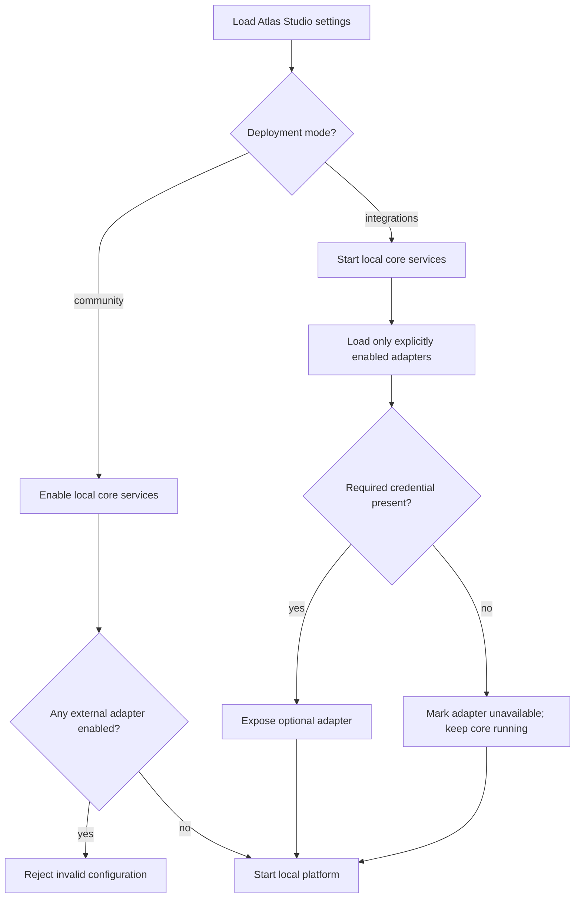

### Phase 3 — initialize durable and transient storage

1. Start PostgreSQL using the pgvector image.
2. Run `001_initial.sql` to create workspaces, agents, tasks, memories, artifacts, and append-oriented audit events.
3. Create the HNSW cosine index for semantic memory retrieval.
4. Run `002_seed.sql` to create the isolated local workspace and all named agents.
5. Start Redis with append-only persistence and bounded memory.
6. Use PostgreSQL for durable task, permission, memory, artifact, and audit records.
7. Use Redis for task snapshots, coordination messages, cache entries, and kill-switch broadcasts.

Data ownership map:

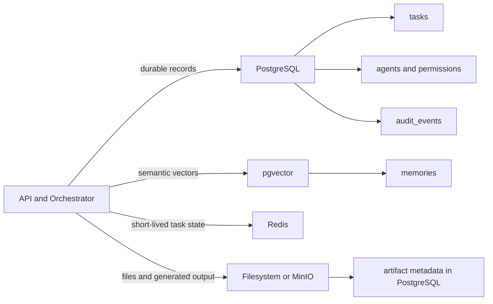

### Phase 4 — register local model providers

1. Implement the `ModelProvider` interface for generation and health checks.
2. Register native Ollama as the default provider.
3. Use the OpenAI-compatible adapter boundary for llama.cpp, vLLM, and compatible Transformers servers.
5. Keep provider selection in the gateway; task and agent logic must never call a vendor SDK directly.
6. Pull model weights separately using the model manifests or `scripts/pull-models.ps1`.

Model request data flow:

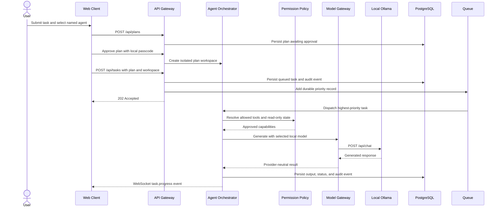

### Phase 5 — implement named agents and tool controls

1. Seed every agent with a name, role, description, and initial tool set.
2. Keep Atlas continuously connected to diagnostics, research, investigation, memory-read, and file-read tools.
3. Mark Atlas read-only in both the database and domain model.
4. Reject `files_write` or `code_execute` for Atlas at the API boundary, even if a modified client sends the request.
5. Assign implementation tools to Forge.
6. Let users enable or disable non-prohibited tools for each agent through the Agents tab.
7. Write every permission change to the audit trail.

Permission workflow:

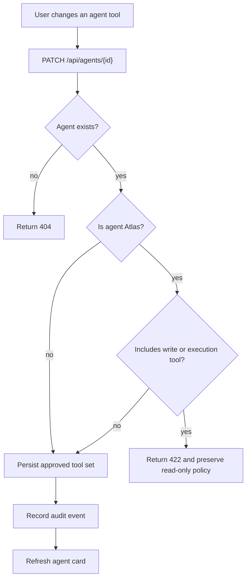

### Phase 6 — isolate tool execution

1. Run execution in a separate worker; never expose the host Docker or Podman socket to the web application.
2. Use rootless Docker or Podman.
3. Start every sandbox with no network, no Linux capabilities, `no-new-privileges`, a read-only root filesystem, and an unprivileged user.
4. Apply CPU, memory, PID, disk, and execution-time limits from `runtime/policies/sandbox.json`.
5. Create one workspace boundary per user or tenant.
6. Mount only the explicitly approved workspace.
7. Default the mount to read-only; Forge may receive a read-write mount only after explicit authorization.
8. Stream sanitized progress events to the API rather than granting the sandbox direct browser access.
9. Subscribe the worker to the Redis kill-switch channel and terminate active sandboxes when `kill` is received.

Sandbox trust boundary:

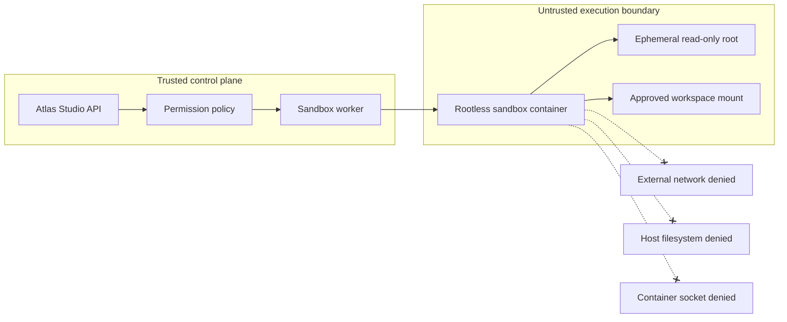

### Phase 7 — handle artifacts safely

1. Read no more than the configured upload limit plus one byte.
2. Reduce the submitted name to a basename and reject any mismatch to prevent path traversal.
3. Allow only the documented extension set.
4. Resolve the final path and confirm it remains inside the artifact root.
5. Store the payload locally by default.
6. Record size, media type, hash, workspace, and storage key in PostgreSQL in the production artifact adapter.
7. Use MinIO only when Integrations mode and its Compose profile are enabled.

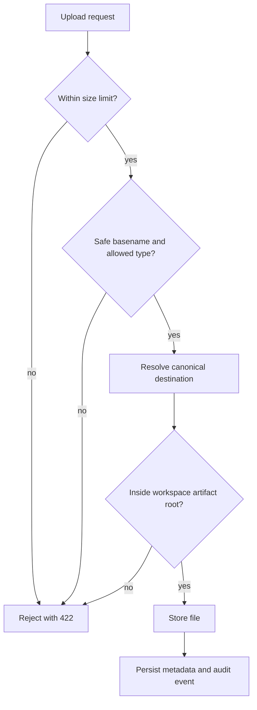

### Phase 8 — stream task progress

1. The client opens `/api/ws` after loading.
2. The API confirms the active deployment mode.
3. Task creation returns immediately with `202 Accepted`.
4. The orchestrator emits `queued`, `running`, and terminal task states.
5. The interface prepends events to Live Activity.
6. A production worker publishes the same event contract through Redis so multiple API replicas can relay it.

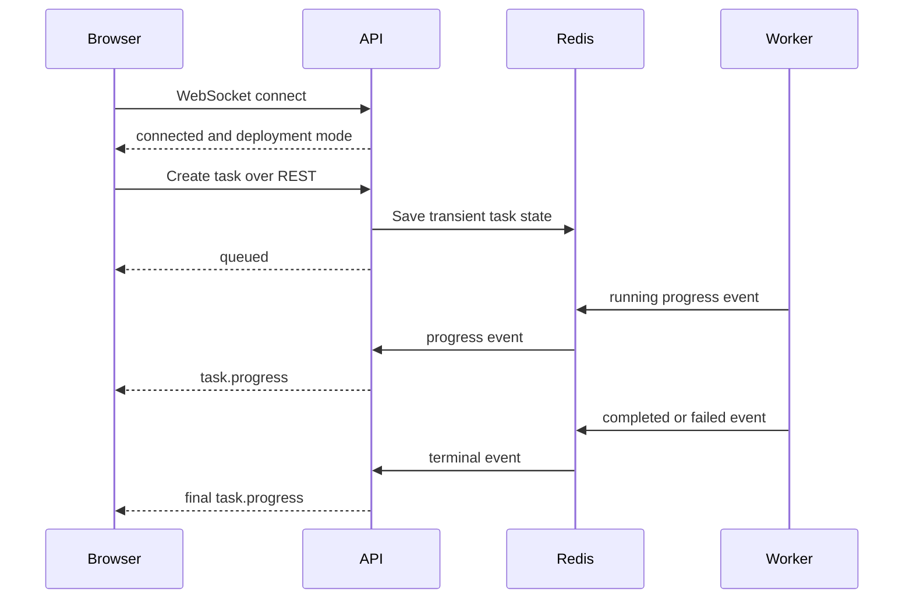

### Phase 9 — integrate local speech and avatars

1. Keep STT, TTS, and avatar services disabled until configured.
2. Point `ATLAS_STUDIO_STT_URL` to a local Whisper-compatible service.
3. Point `ATLAS_STUDIO_TTS_URL` to a local Piper or Kokoro service.
4. Serve approved `.glb` or `.gltf` assets from local artifact storage.
5. Drive avatar listening, thinking, speaking, and idle states from WebSocket events.
6. Never require hosted speech credentials for text interaction.

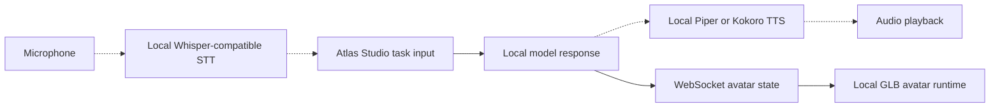

### Phase 10 — implement operational safety

1. Expose liveness independently from dependency readiness.
2. Report PostgreSQL, Redis, and the model gateway separately.
3. Keep the interface accessible in degraded mode so operators can diagnose missing local services.
4. Store task creation, execution, permission changes, cancellation, uploads, and kill-switch transitions as audit events.
5. When the kill switch is engaged, reject new tasks, cancel queued/running state, publish `kill`, and terminate worker sandboxes.
6. Do not label ordinary local storage, access control, or transport features as “encryption.” Describe the actual protection instead.

Kill-switch workflow:

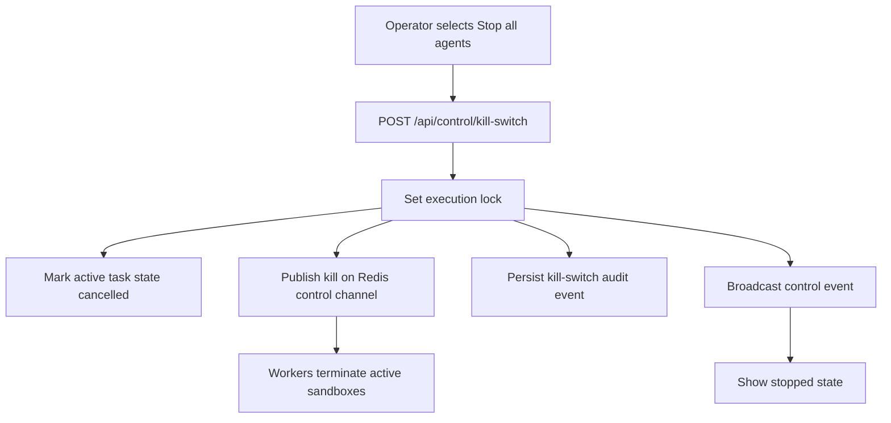

### Phase 11 — deploy and verify

1. Copy the example configuration.
2. Build and start the local services.
3. Pull referenced model weights separately.
4. Confirm API liveness and readiness.
5. Open the web client and inspect Community mode.
6. Confirm Atlas cannot be assigned implementation tools.
7. Submit a task to Forge and watch WebSocket progress.
8. Upload one permitted document and confirm an executable is rejected.
9. Engage the kill switch and confirm task creation returns `423`.
10. Review the audit trail.

```powershell
Copy-Item .env.example .env
docker compose up -d --build
./scripts/pull-models.ps1
docker compose ps
Invoke-RestMethod http://localhost:8080/api/health/live
Invoke-RestMethod http://localhost:8080/api/health/ready
```

Expected readiness after models and dependencies initialize:

```json
{
  "status": "ready",
  "components": {
    "api": "ok",
    "model_gateway": "ok",
    "postgres": "ok",
    "redis": "ok"
  },
  "core_available_without_cloud": true
}
```

## 4. End-to-end task lifecycle

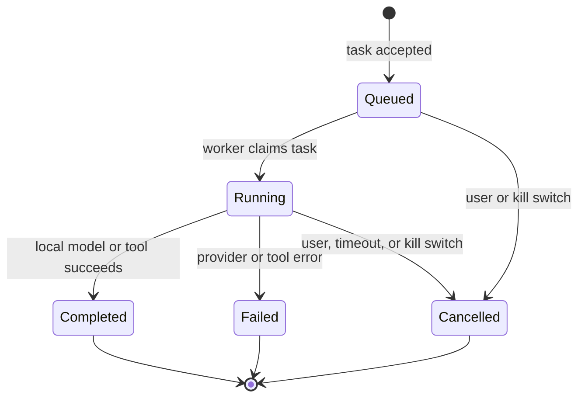

Every transition updates durable task state, refreshes the Redis snapshot, emits a WebSocket event, and records an audit event where appropriate.

## 5. Semantic memory flow

The database schema reserves 1,024-dimensional embeddings for the default local embedding profile. If another embedding model uses a different dimension, create a migration rather than coercing vector sizes.

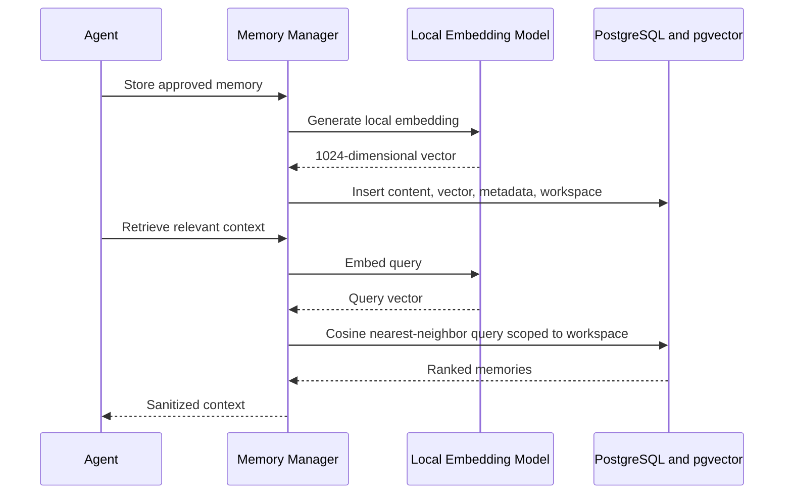

Workspace scoping must be part of every memory query. Retrieval must never rely on post-query filtering.

## 6. Production hardening sequence

Implement these increments in order:

1. Scale the durable Redis priority dispatcher into separate model-execution worker processes.
2. Add multi-user local authentication and workspace-aware role-based access controls.
3. Add a reverse proxy with locally managed TLS for any network-exposed deployment.
4. Add content hashing and optional malware scanning to the artifact service.
5. Implement rootless Docker and Podman sandbox adapters against the committed worker policy.
6. Add a local embedding provider and workspace-scoped pgvector retrieval endpoints.
7. Add MinIO, Whisper-compatible STT, Piper/Kokoro TTS, and browser/search adapters one at a time behind feature flags.
8. Add backup/restore, audit retention, dependency license scanning, model provenance verification, and disaster-recovery tests.
9. Run concurrency, cancellation, timeout, path traversal, cross-workspace access, and kill-switch integration tests.
10. Document the exact version and license of every selected model and local avatar asset.

## 7. Verification matrix

| Area | Verification | Expected result |
|---|---|---|
| Community startup | Start with `.env.example` values | No vendor credential required |
| Provider outage | Stop Ollama | API remains live; readiness is degraded |
| Database outage | Stop PostgreSQL after startup | UI remains diagnosable; persistence reports unavailable |
| Atlas policy | Attempt to add `files_write` | API returns `422` |
| Tool control | Toggle an allowed tool | Agent updates and audit event is created |
| Upload safety | Upload `../payload.exe` | API returns `422` |
| Workspace boundary | Resolve a path outside artifact root | Request is rejected |
| Kill switch | Stop all agents, then create a task | API returns `423` |
| WebSocket | Execute a local task | Client receives queued/running/terminal events |
| Optional adapters | Omit cloud keys | Core services continue to operate |
| Telemetry | Run Community mode | Telemetry remains disabled |
| Model licensing | Inspect manifests | Weights are referenced, not bundled |

## 8. Definition of done

A standalone increment is complete only when:

- it runs inside the isolated Atlas Studio Compose project;
- Community mode works without external keys;
- configuration validation fails safely and clearly;
- the API, UI, persistence, audit, and progress contracts agree;
- Atlas remains read-only and Forge remains the implementation agent;
- permissions are enforced on the server, not only displayed in the UI;
- resource, workspace, upload, and network boundaries have tests;
- degraded optional services do not cause a hard application failure;
- documentation and diagrams are updated with the implementation; and
- model weights or assets are not redistributed without verified permission.

