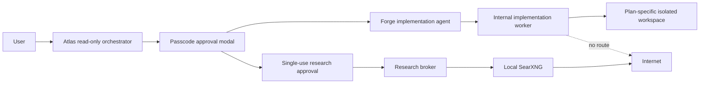
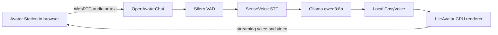

# Atlas Studio — Standalone

Atlas Studio is a self-hosted, local-first agent platform built from open-source software and locally running open-weight models. It requires no purchased API tokens, vendor keys, cloud accounts, or mandatory telemetry.

For the phased build process, architecture diagrams, workflows, data flows, security boundaries, and verification matrix, see [IMPLEMENTATION.md](IMPLEMENTATION.md).

## What is included

- Provider-neutral model gateway with Ollama first and an OpenAI-compatible protocol adapter for self-hosted llama.cpp, vLLM, and Transformers servers.
- Named agents with user-controlled tools. **Atlas** retains continual read-only diagnostics, research, and investigation visibility; **Forge** owns implementation work.
- REST APIs, WebSocket task progress, health endpoints, audit events, task cancellation, and a platform kill switch.
- PostgreSQL 16 with pgvector semantic memory schema, Redis for queue/cache/transient state, filesystem artifacts by default, and optional MinIO.
- Upload filename/type/size validation, workspace-scoped persistence, and a deny-network-by-default rootless sandbox policy.
- A real, read-only Workspace Explorer that mounts the selected project at `/workspace`, hides secrets and generated dependency folders, rejects traversal and symlink escapes, audits previews, and opens supported files in the Code page.
- Local speech adapter settings for Whisper-compatible STT and Piper/Kokoro TTS, plus a local GLB/avatar tool boundary.
- A standalone web control surface with Community/Integrations mode visibility and per-agent skill/tool controls.
- **Workers by Delos**, a visual-agent studio that binds worker identities and multi-angle local avatar assets to the existing named-agent permission model.
- **LiteLLM Integration** - Unified LLM provider interface supporting 100+ providers with built-in cost tracking, fallback routing, and observability.
- **MITM Security Layer** - Man-in-the-Middle security middleware with input validation, policy enforcement, audit logging, and output sanitization.
- **AI Coding Assistant** - Cursor-like capabilities for file browsing, code editing, command execution, and implementation planning.
- **End-to-End Lifecycle Automation** - Automated progression from user input through development, testing, sandbox, and production deployment.
- **Multi-Modal Input** - Support for text, speech, files, and screenshots with automatic conversion to structured requests.
- **Compliance SDK Integration** - SOC 2, ISO 27001, and NIST CSF compliance with audit hash chaining, data classification, and OSCAL documentation.

### Workers by Delos avatar assets

Worker models are served from `src/atlas_studio/static/avatars`. Atlas uses the supplied textured `atlas_worker.glb`, rendered through Atlas Studio's dependency-free WebGL runtime. Its front, portrait, and profile source images are preserved under `avatars/references`. The optional `scripts/generate_worker_glb.py` command creates a separate geometric fallback named `atlas_worker_stylized.glb`; it never overwrites the supplied model. No external renderer or CDN is required.

### Local open-source image-to-3D generation

Atlas has a narrowly scoped `avatar_generate` capability that does not grant general file-write or code-execution access. Atlas Studio runs the MIT-licensed TripoSR source and pretrained model followed by headless Blender cleanup inside an optional local container. Images, generation jobs, model weights, reference views, and GLB results remain on the user's machine.

Enable it in `.env`:

```dotenv
ATLAS_STUDIO_AVATAR_LOCAL_ENABLED=true
ATLAS_STUDIO_AVATAR_PROVIDER=triposr-local
ATLAS_STUDIO_AVATAR_SERVICE_URL=http://avatar3d:8090
```

Start the service with `docker compose --profile avatar-local up -d --build`. In **Workers → Build a local avatar with Blender**, provide a required front PNG/JPEG and optional left, right, and rear references (10 MB each), then confirm you have permission to use them. Atlas follows the local job, validates the returned binary GLB, and saves it in local artifact storage. The result is staged for review and does not replace the supplied Atlas model until the user selects **Use this preview**.

The current reconstruction stage uses the front image for geometry. Optional profile/rear views are retained with the local job for inspection and future multi-view reconstruction; Blender cannot infer an accurate human likeness from those photographs by itself. Blender currently normalizes the mesh, adds minimum thickness to severely shallow output, smooths and optimizes geometry, preserves materials, and exports a web-ready GLB. Human rigging and true multi-view geometry fitting remain a separate production stage.

### Full-body speaking avatar

Atlas Studio includes an optional, completely local speaking-avatar profile. It bundles the MIT-licensed TalkingHead and Three.js browser runtime, a CC0 MPFB full-body model with a humanoid rig and facial visemes, and a local HeadTTS service using the Kokoro timestamped ONNX model. No speech or avatar API key is required.

Start it with:

```powershell
docker compose --profile speaking-avatar up -d --build app headtts
```

Open **Workers**, select Atlas, and choose **Enable speaking avatar**. The first local speech request downloads the Kokoro model into the persistent `atlas_studio_speech_models` volume. Use **Speak latest response** after Atlas answers in the Command tab.

The included MPFB character is a functional rigged foundation, not yet Atlas's final likeness. The approved front, portrait, left, right, and rear images remain under `static/avatars/references` for Blender customization. The supplied photo-derived `atlas_worker.glb` cannot be converted directly because it contains no skeleton, animation, or facial morph targets. Visual customization must preserve the MPFB rig plus its ARKit/Oculus morph targets.

No paid service, account, API key, or per-generation credit is used. The first build downloads open-source dependencies, and the first generation populates the persistent local model cache. A GPU is faster, but the default worker is configured for CPU compatibility. Do not process a person's image without their authorization.

No model weights are bundled. Manifests in `models/manifests` point to suggested models and preserve upstream licensing decisions.

## Quick start

Requirements: Docker Desktop with Compose (or a compatible rootless Docker/Podman setup), at least 16 GB RAM for the suggested 8B model, and sufficient model storage.

```powershell
Copy-Item .env.example .env
docker compose up -d --build
./scripts/pull-models.ps1
```

Open the Atlas Studio engineering dashboard at <http://localhost:8080>. API documentation is at <http://localhost:8080/api/docs>. The optional legacy holographic portal is published separately at <http://localhost:8082>.

The application becomes available before a model is downloaded and reports the model gateway as degraded. Pulling `qwen3:4b` enables default task execution. Forge uses `qwen3:4b` by default so its workspace inspection and change-proposal loop remains responsive on memory-constrained local hardware:

```powershell
docker compose exec ollama ollama pull qwen3:4b
```

## Deployment modes

**Community (default):** Ollama, PostgreSQL/pgvector, Redis, local filesystem artifacts, local agents, no external connector, and no telemetry. Configuration validation rejects accidental external integrations in this mode.

**Additional self-hosted services:** Set `ATLAS_STUDIO_MODE=integrations`, explicitly enable only the desired local adapters, then start the associated Compose profile. MinIO example:

```powershell
docker compose --profile integrations up -d --build
```

Disabled local services never stop the core platform. Atlas Studio contains no commercial-provider credential requirement.

## Provider extension

Ollama uses its native chat API. Self-hosted llama.cpp, vLLM, and local Transformers servers can use the included OpenAI-compatible protocol class. Provider implementations must remain local and open-source.

## Safety boundary

The web/API process does not receive the Docker socket. A separate implementation worker performs allow-listed file writes and Python/test commands inside a plan-specific workspace copied into a dedicated local volume. It has no external network, no Linux capabilities, `no-new-privileges`, a read-only container root, and bounded CPU, memory, and process counts. Every mutating action is checked against the selected agent's tools and consumes an exact, expiring, one-time approval. Atlas remains read-only even if a client bypasses the UI.

The same internal worker can render allow-listed Atlas Studio pages with rootless headless Chromium for read-only UI investigations. It cannot reach the public internet, and the agent tool exposes no click, type, upload, or submit operation. Bundled `skills/*/SKILL.md` instructions are loaded only for agents to which the user assigns them; skill assignments are approval-gated and persisted with the agent.

Open **Implementation** after startup. Every protected action now receives a cryptographically random six-digit local challenge that expires after five minutes, is hashed only in process memory, and locks after five failed entries. Forge can inspect only the isolated workspace created for an approved plan. Its model-facing tools are limited to listing files, reading files, searching text, and proposing a multi-file change set. The model cannot write files, execute commands, change permissions, use Git, deploy, or access the internet.

The user-owned Forge delivery sequence is:

1. Create a plan and approve it with the passcode modal.
2. Forge inspects the plan workspace and returns a complete multi-file diff.
3. Review the diff in **Implementation → Proposed change sets**.
4. Approve the exact file write. The one-time approval is cryptographically bound to the file paths, contents, and expected hashes.
5. Approve the standard test run and inspect its captured output and exit code.
6. If tests pass, approve creation of an `atlas/…` branch and local Git commit.

Each gate uses a distinct expiring, single-use approval. A write approval cannot authorize tests or Git, and Forge cannot modify its own permissions. Start or rebuild the core services with:

```powershell
docker compose up -d --build app worker portal
```

See [the Forge first-run guide](docs/FORGE_FIRST_RUN.md) for the exact UI sequence, guarantees, and current delivery boundary.

If Ollama times out while optional avatar models are consuming memory, run `powershell -ExecutionPolicy Bypass -File .\scripts\forge-performance-mode.ps1`. It stops only the optional avatar/speech containers, keeps the engineering control plane running, and unloads a retained Ollama session before the next request.

Optional internet research is isolated from that worker. Start the open-source SearXNG route only when needed:

```powershell
docker compose --profile web-search up -d --build research-worker searxng
```

In **Settings → Approved internet research**, Atlas records the exact query, purpose, optional domain restriction, and a 15-minute expiry. The external route remains blocked until the passcode modal approves it, and the approval is consumed after one search. Docker action requests use the same approval record type, but raw Docker socket mounting and generic Docker execution remain deliberately disabled until a narrow verb-specific broker is implemented.



The kill switch prevents new tasks, removes queued work from Redis, and marks queued/running tasks cancelled. The task dispatcher uses a durable Redis priority queue and reconstructs task state from PostgreSQL after restart; interrupted running work returns to the queue with an incremented attempt record.

### Authorized development lifecycle

```mermaid
flowchart LR
    Request["User requests plan"] --> Plan["Atlas records scoped plan"]
    Plan --> Approve["Passcode decision"]
    Approve --> Copy["Create isolated plan workspace"]
    Copy --> Queue["Redis priority queue"]
    Queue --> Forge["Forge implementation"]
    Forge --> Diff["Multi-file diff review"]
    Diff --> WriteApproval["Exact write approval"]
    WriteApproval --> Test["Approved test gate with captured evidence"]
    Test --> Sandbox["Sandbox gate with test or security evidence"]
    Sandbox --> ProdApproval["Exact one-time Production approval"]
    ProdApproval --> Production["Production lifecycle complete"]
```



Direct implementation tasks cannot bypass this path. Implementation-capable agents require both an approved plan and its ready workspace. Read-only research and diagnostic tasks can still be created directly.

### LangGraph workflow and security layers

Atlas Studio places local agent responses behind a **LangGraph OSS** workflow boundary. The active universal graph runs policy first, then the selected local model, and finally deterministic completion handling. When PostgreSQL is available, it uses the LangGraph PostgreSQL checkpointer; a process fallback keeps development installations usable while the database is offline.

The dashboard now includes **Workflows** and **Security** control-plane pages. Workflows shows the engine, checkpoint backend, workflow definitions, and platform layers. Security shows API-enforced controls, Sentinel's permitted tools, workspace and sandbox boundaries, authorization gates, the kill switch, and recent audit events. Security decisions live in `src/atlas_studio/layers/security.py`; they are not delegated to model prompts.

The workflow page also supports two governed intake paths. **Request a workflow** records a desired outcome and references without granting execution authority. **Add a manual workflow** accepts a reviewed definition from a local library, an existing skill, or an external-resource reference, but consumes an exact one-time passcode approval and leaves the definition pending security review. External references are stored as untrusted metadata and are never downloaded or executed automatically.

The built-in **Research and development delivery** workflow follows:

```text
User question -> Atlas intake and scope -> Sage research plan
-> explicit egress approval when web research is needed
-> primary-source research -> Blueprint option analysis
-> user prototype approval -> Forge isolated prototype
-> Quanta QA -> Sentinel security + Counsel legal review
-> sandbox evidence -> user-owned implementation decision
```

Forge never receives general internet access through this workflow. Approved external research remains isolated in the Sage/SearXNG research route, and only reviewed findings cross into Forge's network-denied implementation workspace.

## Development and verification

```powershell
python -m venv .venv
.venv\Scripts\pip install -e ".[test]"
.venv\Scripts\pytest
```

Configuration is environment-driven; `.env.example` contains no required external secret. Database migrations and named-agent seeds run automatically when PostgreSQL initializes. Use separate generated passwords and an authentication/TLS proxy before any multi-user or network-exposed deployment.

## Current implementation boundary

This standalone release provides the local deployment foundation and operational control plane. Tasks, plans, plan workspaces, Forge change sets, development lifecycle gates, permission changes, external-action approvals, and audit events are persisted to PostgreSQL. Redis supplies the durable priority queue, transient task snapshots, and kill-switch messages. The implementation worker is a dedicated internal service and all implementation writes, tests, and governed local commits are scoped to an approved plan workspace. Remote Git push, pull requests, and real Development/Test/Sandbox/Production deployment adapters remain intentionally unimplemented until identity, sessions, RBAC, and concrete deployment targets are connected.

Licensed under Apache-2.0. Model weights and avatar assets retain their respective upstream licenses.
# Holographic Gradio portal

The default browser experience is the Atlas Studio engineering dashboard at
`http://localhost:8080`. The optional holographic portal is separate at
`http://localhost:8082`, while API documentation is served at `http://localhost:8080/api/docs`. The portal submits
tasks, uploads files, and polls results through those existing APIs; it does
not duplicate model or storage logic.

```powershell
docker compose up -d --build
```

The circular video surface autoplays a file returned by an optional local
talking-video adapter. Set `ATLAS_STUDIO_TALKING_VIDEO_ENDPOINT` on the
`portal` service only when such a local adapter is installed. Without it,
Atlas still responds normally and no cloud credential is required.

## Optional EchoMimic V2 avatar laboratory

Atlas Studio includes an AI Avatar Development Station that embeds the
official Apache-2.0 EchoMimic V2 Gradio application. It is isolated behind the
`avatar-lab` profile because the upstream project requires CUDA 11.7+ and was
tested on NVIDIA GPUs with 16 GB or more VRAM. It is not a dependency of
Community mode and no model weights are bundled.

On a compatible NVIDIA host, populate the named
`atlas_studio_echomimic_models` volume with the official EchoMimic V2
`pretrained_weights` tree, then start:

```powershell
docker compose --profile avatar-lab up -d --build echomimic
```

Open the station from Atlas Studio or directly at
`http://localhost:8080/static/avatar-station.html`. The upstream laboratory is
published locally at `http://localhost:7861`.
## LiteAvatar + OpenAvatarChat live avatar

Atlas Studio now includes an optional, source-built live avatar runtime. It uses
OpenAvatarChat for the WebRTC conversation surface and LiteAvatar for real-time
2D audio-driven rendering. Its configured path is local-only: SenseVoice for
speech recognition, Ollama (`qwen3:8b`) for the response, local CosyVoice for
speech synthesis, and LiteAvatar in CPU fast mode. No vendor credential is read.

Start it from PowerShell in the project folder:

```powershell
docker compose --profile live-avatar up -d --build openavatarchat
docker compose --profile live-avatar ps
```

The first launch downloads the official open model files into Docker volumes and
can take several minutes. Follow its preparation with:

```powershell
docker compose --profile live-avatar logs -f openavatarchat
```

When the service is healthy, first open `http://localhost:8282`. Then use the integrated station at
`http://localhost:8080/static/avatar-station.html`. The browser will ask for
microphone permission because OpenAvatarChat communicates over WebRTC.



The included identity is the upstream sample avatar. Replacing it with Atlas's
approved human likeness is a separate asset-preparation step: LiteAvatar expects
an avatar data package, not an arbitrary photograph at runtime. Reference images
must remain permission-controlled and local.

## Lifecycle governance

See [the lifecycle acceptance test](docs/LIFECYCLE_ACCEPTANCE_TEST.md) for the start-to-finish agent test case, each named agent's governed workflow, hallucination controls, lifecycle gates, and audit evidence requirements.

## MITM Security Architecture

All requests, responses, and agent actions pass through a controlled middleware layer that validates, sanitizes, logs, and enforces policies before reaching any component.

```
┌─────────────────────────────────────────────────────────────────────────────┐
│                           USER LAYER                                        │
│  (Browser, CLI, API Client)                                                 │
└─────────────────────────────────────────────────────────────────────────────┘
                                    │
                                    ▼
┌─────────────────────────────────────────────────────────────────────────────┐
│                     MITM SECURITY MIDDLEWARE                                │
│  ┌─────────────┐  ┌─────────────┐  ┌─────────────┐  ┌─────────────┐       │
│  │   Input     │  │   Policy    │  │   Audit     │  │   Output    │       │
│  │  Validator  │  │   Engine    │  │   Logger    │  │  Sanitizer  │       │
│  └─────────────┘  └─────────────┘  └─────────────┘  └─────────────┘       │
│  ┌─────────────┐  ┌─────────────┐  ┌─────────────┐  ┌─────────────┐       │
│  │   Rate      │  │   Auth      │  │   Encrypt   │  │   Throttle  │       │
│  │  Limiter    │  │  Checker    │  │   Layer     │  │   Queue     │       │
│  └─────────────┘  └─────────────┘  └─────────────┘  └─────────────┘       │
└─────────────────────────────────────────────────────────────────────────────┘
                                    │
                                    ▼
┌─────────────────────────────────────────────────────────────────────────────┐
│                      INPUT PROCESSING PIPELINE                              │
│  ┌──────────┐       ┌──────────┐      ┌──────────┐      ┌──────────┐      │
│  │  Speech   │       │  Vision  │      │   Text   │      │   File   │      │
│  │  (STT)   │       │ (OCR)    │      │ (Parse)  │      │ (Extract)│      │
│  └──────────┘       └──────────┘      └──────────┘      └──────────┘      │
└─────────────────────────────────────────────────────────────────────────────┘
                                    │
                                    ▼
┌─────────────────────────────────────────────────────────────────────────────┐
│                    ATLAS REQUEST INTAKE                                      │
│         (Classification, Scoping, Routing)                                  │
└─────────────────────────────────────────────────────────────────────────────┘
                                    │
                                    ▼
┌─────────────────────────────────────────────────────────────────────────────┐
│                  AUTOMATED LIFECYCLE ENGINE                                  │
│  ┌──────────┐  ┌──────────┐  ┌──────────┐  ┌──────────┐  ┌──────────┐    │
│  │  Development │→│   Test   │→│ Sandbox  │→│Production │→│ Complete  │    │
│  └──────────┘  └──────────┘  └──────────┘  └──────────┘  └──────────┘    │
│                     ↑              │              │                         │
│                     │              ▼              ▼                         │
│                     │        ┌──────────┐  ┌──────────┐                   │
│                     └────────│ Rollback │  │ Deploy   │                   │
│                              └──────────┘  └──────────┘                   │
└─────────────────────────────────────────────────────────────────────────────┘
                                    │
                                    ▼
┌─────────────────────────────────────────────────────────────────────────────┐
│                         DEPLOYMENT                                          │
│              (Sandbox → Production → Git Commit)                            │
└─────────────────────────────────────────────────────────────────────────────┘
```

### MITM Components

| Component | Purpose |
|-----------|---------|
| `MITMSecurityMiddleware` | Core middleware intercepting all HTTP requests |
| `PolicyEngine` | Enforces access control and security policies |
| `InputValidator` | Validates inputs for dangerous patterns (XSS, SQLi, path traversal) |
| `AuditLogger` | Records all requests, responses, and agent actions |
| `OutputSanitizer` | Redacts sensitive data from responses (API keys, passwords, tokens) |
| `RateLimiter` | Prevents abuse with configurable rate limits |
| `AuthChecker` | Validates authentication tokens and session cookies |

### Security Headers Added

- `X-Content-Type-Options: nosniff`
- `X-Frame-Options: DENY`
- `X-Request-ID: <unique-hash>`

## End-to-End Lifecycle Automation

The lifecycle automatically progresses from user input through development, testing, sandbox, and production deployment.

### Lifecycle Stages

| Stage | Description | Exit Criteria |
|-------|-------------|---------------|
| Development | Code changes implemented | All tests pass, no security issues |
| Test | Automated test execution | Test coverage threshold met |
| Sandbox | Isolated environment testing | Integration tests pass |
| Production | Live deployment | Health checks pass |
| Complete | Deployment successful | Audit trail complete |
| Rollback | Previous state restored | Rollback verification passed |

### Rollback Mechanism

- Snapshot state at each lifecycle stage
- Automatic rollback on failure or timeout
- Manual rollback via approval challenge
- All rollback events logged to audit trail

## Multi-Modal Input Pipeline

Support for text, speech, files, and screenshots with automatic conversion to structured requests.

### Input Types

| Type | Processing | Output |
|------|------------|--------|
| Text | Parse and classify | Structured request |
| Speech | STT transcription | Text → structured request |
| File | Extract text content | Text → structured request |
| Screenshot | OCR + image analysis | Structured request |

### Input Router

```
Input → Router → Text Parser / Speech STT / File Extractor / Vision OCR
                    ↓
            Structured Request
                    ↓
            Atlas Request Intake
```

## AI Coding Assistant

Cursor-like capabilities for the frontend, enabling code editing, command execution, and implementation planning.

### Capabilities

| Feature | Description |
|---------|-------------|
| File Explorer | Browse project structure |
| Code Editor | Edit files with syntax highlighting |
| Terminal | Execute commands in project context |
| Plan Viewer | View and manage implementation plans |
| AI Assistant | Chat with AI about code changes |

### Suggested Prompts

The enhanced chat panel includes pre-built prompts for common operations:

| Prompt | Feature | Input Fields |
|--------|---------|--------------|
| WORKSPACE EXPLORER | Browse files | Path, File filter |
| CODE EDITOR | View/edit code | File path, Operation type |
| TERMINAL | Execute commands | Command, Working directory |
| PLAN VIEWER | Manage plans | Plan action, Plan ID |
| REQUEST INTAKE | Submit requests | Request type, Priority, Description |
| LIFECYCLE | Track progress | Lifecycle stage, Action |
| SECURITY | Audit & review | Security check, Time range |
| AI ASSISTANT | Chat about code | Context, Focus area |

### Dynamic Input Fields

Each prompt includes contextual input fields that adapt to the selected feature:

- **Workspace Explorer**: Path and filter inputs
- **Code Editor**: File path and operation selector
- **Terminal**: Command and working directory
- **Plan Viewer**: Action selector and plan ID
- **Request Intake**: Type, priority, and description
- **Lifecycle**: Stage and action selectors
- **Security**: Check type and time range
- **AI Assistant**: Context and focus area

### Architecture

```
Frontend UI
    ├── File Explorer (read-only by default)
    ├── Code Editor (with change approval)
    ├── Terminal (sandboxed commands)
    ├── Plan Viewer (implementation plans)
    └── AI Assistant (context-aware chat)
            ↓
    Backend API
            ↓
    Atlas Agent System
            ↓
    Forge (implementation)
    Atlas (research/diagnostics)
```

## Compliance SDK Integration

SOC 2, ISO 27001, and NIST CSF compliance with automated audit and evidence collection.

### Compliance Requirements

| Standard | Control | Implementation |
|----------|---------|----------------|
| SOC 2 | CC6.1 | Logical access controls via PolicyEngine |
| SOC 2 | CC7.2 | Audit logging via AuditLogger |
| SOC 2 | CC8.1 | Change management via lifecycle gates |
| ISO 27001 | A.12.1.4 | Input validation via InputValidator |
| ISO 27001 | A.14.2.5 | Secure development via Forge sandbox |
| NIST CSF | PR.DS-1 | Data-at-rest encryption (SQLite) |
| NIST CSF | PR.AC-1 | Authentication via AuthChecker |

### Audit Hash Chaining

Every audit event is linked to the previous event via SHA-256 hash chain, providing tamper-evident audit trail.

### Data Classification

| Level | Description | Example |
|-------|-------------|---------|
| Public | No sensitivity | Health endpoints |
| Internal | Business sensitive | Agent configurations |
| Confidential | User secrets | API keys, passwords |
| Restricted | Regulated data | PII, financial data |

## LiteLLM Integration

Unified LLM provider interface supporting 100+ providers with built-in cost tracking and observability.

### Supported Providers

| Provider | Model Example | Cost |
|----------|---------------|------|
| Ollama | qwen3:8b | Free |
| OpenAI | gpt-4o | $/token |
| Anthropic | claude-3-sonnet | $/token |
| Google | gemini-pro | $/token |
| + 100 more | Various | Various |

### Features

- Automatic fallback routing
- Cost tracking per request
- Model performance metrics
- Provider health monitoring
- Local-only mode (no API keys required)

## Files Structure

| Directory | Purpose |
|-----------|---------|
| `src/atlas_studio/security/` | MITM middleware, policy engine, validators |
| `src/atlas_studio/input/` | Multi-modal input processing |
| `src/atlas_studio/lifecycle/` | Lifecycle engine and deployment |
| `src/atlas_studio/compliance/` | Compliance SDK and audit |
| `docs/implementation/` | Implementation plans and code templates |
| `skills/` | Skill definitions and workflow routing |
| `src/atlas_studio/static/atlas-enhanced-chat.html` | Enhanced chat with suggested prompts |
| `src/atlas_studio/static/atlas-enhanced-chat.css` | Styling for enhanced chat panel |
| `src/atlas_studio/static/atlas-enhanced-chat.js` | JavaScript for prompt selection and inputs |
