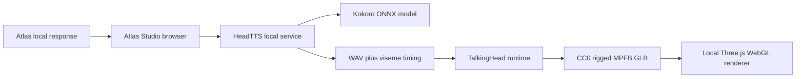

# Atlas Studio speaking-avatar architecture

## Continuous local conversation

Atlas uses a browser-managed conversation session instead of returning a
standalone audio attachment. Click Atlas or **Start voice conversation** once:

1. The browser requests microphone permission one time.
2. A lightweight local voice-activity detector listens for speech and treats
   about one second of silence as the end of the user's turn.
3. The app proxies that audio to the local Whisper-compatible speech worker.
4. The transcript is sent to Atlas through the normal audited task API and the
   configured Ollama model.
5. Atlas's text appears in the transcript and is synthesized by the local
   Kokoro worker.
6. Microphone listening resumes after playback and continues until the user
   clicks Atlas or the microphone button again.

The microphone is stopped while Atlas is speaking to avoid feedback. Typed
messages and locally uploaded documents use the same transcript and task flow.

Atlas defaults to Kokoro's `af_bella` American English voice at a slightly
measured `0.97` speaking rate. Both are configurable through
`ATLAS_SPEECH_KOKORO_VOICE` and `ATLAS_SPEECH_KOKORO_SPEED`.

## Data flow

1. Atlas produces text through the existing Ollama gateway.
2. The browser retains the latest completed response; speech is user-initiated.
3. HeadTTS synthesizes audio and Oculus viseme timing locally on port 8882.
4. TalkingHead plays the audio, drives facial morph targets, and animates the full-body rig.
5. Three.js renders the bundled GLB without a CDN or runtime cloud dependency.

## Likeness workflow

The five Atlas photographs are reference material, not rig data. Customize the MPFB model in Blender while preserving:

- the humanoid armature and bone names;
- ARKit facial blend shapes;
- Oculus viseme blend shapes;
- jaw, eye, neck, and head weights;
- the GLB root object named `Armature`.

Export the reviewed result as `mpfb-speaking-atlas.glb`, validate skins and morph targets, and only then replace the generic speaking foundation.

## Licenses

- TalkingHead: MIT
- HeadTTS: MIT
- Three.js: MIT
- MPFB example avatar: CC0, as documented by TalkingHead
- Kokoro timestamped ONNX model: Apache-2.0
