# Forge first-run guide

Forge is Atlas Studio's implementation agent. Atlas remains the read-only coordinator. Forge cannot grant itself tools, use the internet, run a shell chosen by the model, deploy, push Git changes, or modify the mounted source project.

## Control flow

```mermaid
flowchart LR
    User["User request"] --> Atlas["Atlas plans and delegates"]
    Atlas --> PlanGate["User approves plan"]
    PlanGate --> Workspace["Isolated plan workspace"]
    Workspace --> Forge["Forge reads and searches files"]
    Forge --> Diff["Reviewable multi-file change set"]
    Diff --> WriteGate["One-time write approval"]
    WriteGate --> Tests["One-time test approval"]
    Tests --> CommitGate["One-time branch and commit approval"]
    CommitGate --> Evidence["Audit and Git evidence"]
```



## Start the milestone

From PowerShell in the Atlas Studio folder:

```powershell
docker compose build app worker
docker compose up -d --force-recreate app worker portal
docker compose exec ollama ollama pull qwen3:4b
docker compose ps app worker portal ollama postgres redis
```

Open <http://localhost:8080>, then use **Delivery → Plans**.

1. Enter one concrete change and keep **Forge - Platform Development AI** selected.
2. Select **Request plan**.
3. Review the plan and approve it with the local passcode.
4. Open **Delivery → Implementation**.
5. In **Proposed change sets**, review every file and the combined diff.
6. Select **Review and approve write** and enter the passcode.
7. Select **Approve test run** and inspect the recorded exit code and output.
8. If tests pass, select **Approve branch and commit**. Atlas creates only an `atlas/...` branch in the isolated workspace.

## Approval guarantees

- Each approval expires and can be used once.
- The approval hash binds the exact action, target, and payload.
- File writes include expected pre-change hashes, so stale proposals fail closed.
- Test authority cannot be reused for a write or Git commit.
- The model receives only read, search, and change-preview tools.
- The implementation worker has no external network and reads the source mount without write access.

## Forge runtime profile

The default local profile is sized for reliable implementation work on a memory-constrained workstation:

- Model: `qwen3:4b`
- Structured-output timeout: 300 seconds
- Maximum generated tokens: 2,048
- Context window: 4,096 tokens
- Worker limit: 2 CPUs, 1 GB memory, 256 processes
- Test command: `python -m pytest -q`

These values are independent from the faster interactive-chat limits. Override the corresponding
`ATLAS_STUDIO_FORGE_*` and `ATLAS_STUDIO_WORKER_*` settings in `.env` only when the local hardware
has enough capacity. Increasing them does not change Forge's permissions or approval requirements.

## Current boundary

This milestone stops at a tested local commit inside the isolated workspace. Remote push, pull requests, deployments, and production promotion are not enabled. Those should be connected only after identity, sessions, RBAC, and actual Development/Test/Sandbox/Production targets are configured.

## Verification

```powershell
docker compose exec app python -m pytest -q
docker compose exec worker python -m pytest --version
docker compose logs --tail 100 app worker
```

If Forge reports that it needs more information, answer the question by creating a newly scoped plan. It is intentionally instructed not to invent missing requirements or file facts.
