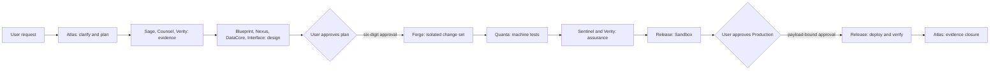

# Atlas Studio lifecycle acceptance test

## Purpose

`TC-LIFECYCLE-001` verifies one authorized software change from user intake through Production. It is both a manual acceptance procedure and the specification served by `GET /api/lifecycle/governance`.

## End-to-end flow

## Acceptance procedure

| Step | Responsible agents | User-initiated action | Required recorded evidence |
|---|---|---|---|
| 1. Intake | Atlas | Submit a specific change and answer any missing-input question. | `plan.create` |
| 2. Research | Sage, Counsel, Verity | Approve external research only if local sources are insufficient. | Source register, `grounding.evaluate`, approved egress record when used |
| 3. Design | Blueprint, Nexus, DataCore, Interface | Review architecture, API, data, and UI decisions. | Decision records and `task.execute` events |
| 4. Authorization | Atlas and user | Review plan and enter its six-digit approval. | `approval.request`, `approval.decision`, `plan.decision` |
| 5. Development | Forge, Scribe, Pixel, Echo | Review the multi-file diff and approve the exact write payload. | Change-set hashes, `forge.change_set.propose`, `.apply` |
| 6. Test | Quanta | Approve the bounded test command. | Command, exit code 0, `.test`, lifecycle Test transition |
| 7. Sandbox | Sentinel, Verity, Release | Review security/compliance findings and promote to Sandbox. | Passing security/test evidence and Sandbox transition |
| 8. Production | Release and user | Enter a fresh six-digit Production approval. | Payload-bound approval and Production transition |
| 9. Closure | Atlas | Review the evidence register and close the work. | Completed lifecycle and audit coverage report |

## Agent workflows

Every named agent has a registered workflow in the Workflows page and `/api/workflows`. The workflow catalog specifies its ordered nodes, expected outputs, grounding controls, and required audit event types. Atlas remains read-only; Forge is the implementation agent; Quanta, Sentinel, and Verity provide independent evidence; Release controls promotion.

## Hallucination security controls

1. Missing-input stop: an agent must identify missing information and ask the user instead of silently choosing.
2. Server-side tool boundary: model text cannot grant permissions or call an unassigned tool.
3. Claim verification: statements that code changed, tests passed, a scan completed, or deployment succeeded require evidence references or become `verification_required`.
4. Source grounding: research, legal, compliance, and security conclusions require source references.
5. Artifact hashes: Forge change sets bind reviewed before/after content with SHA-256.
6. Machine evidence: lifecycle gates reject narrative-only claims.
7. Human approval: high-risk actions require an expiring, single-use, payload-bound six-digit approval.
8. Separation of duties: implementation evidence is independently evaluated before Production.

## Negative tests

- Omit a required requirement: the agent asks rather than assuming.
- Ask a read-only agent to edit: the API rejects the action.
- Submit an unsupported completion claim: the task is marked `verification_required`.
- Alter an approved write payload: approval consumption fails.
- Advance to Test without completed implementation evidence: the lifecycle API returns a conflict.
- Advance to Sandbox without passing test/security evidence: the lifecycle API returns a conflict.
- Advance to Production without a matching one-time approval: the lifecycle API rejects the transition.

## Pass criteria

- Each stage has machine-readable evidence.
- Every participating agent has task, workflow-start, grounding, and execution audit records.
- No lifecycle gate accepts narrative-only evidence.
- Production has a matching consumed approval.
- The Workflows audit coverage board reports which required event types were observed and never treats missing activity as completed.

## Operations

- View the live specification: `GET /api/lifecycle/governance`
- View all events: `GET /api/audit`
- View task grounding counts and evidence: `GET /api/metrics`
- Stop execution immediately: the platform kill switch
