# Atlas Studio Platform Infrastructure and Agent Workflow Blueprint

Status: target architecture based on the current Atlas Studio repository and its existing Docker Compose services. Components marked **planned** are design targets, not claims that they already exist.

## 1. Architecture decisions

1. **Atlas remains the read-only orchestrator.** Atlas may inspect, diagnose, research, plan, and delegate, but may not edit code, execute implementation tools, change databases, or deploy.
2. **The user is the authority boundary.** Any mutating, privileged, externally connected, or release action pauses for an explicit approval that shows the proposed action, scope, agent, tools, and rollback plan.
3. **Named specialist agents perform the work.** Forge is the primary implementation agent. Sentinel, Quanta, Verity, Counsel, and Release provide independent gates appropriate to the risk.
4. **Community mode remains fully local.** Ollama, PostgreSQL/pgvector, Redis, filesystem artifacts, local speech, and local sandboxes are sufficient. Optional integrations are disabled by default.
5. **Recommended workflow engine: LangGraph OSS embedded in FastAPI.** Use the open-source Python library, an `AsyncPostgresSaver`, and Atlas Studio's own API/UI. Do not require LangSmith, a hosted control plane, or a vendor key.
6. **Redis is transient, PostgreSQL is authoritative.** Redis carries queues, locks, cache, cancellation signals, and WebSocket fan-out. PostgreSQL stores durable workflow state, approvals, audit evidence, checkpoints, and semantic memory.
7. **Every workflow is evidence-producing.** A task is not complete until its outputs, validations, tool invocations, approval records, and artifact hashes are persisted.

## 2. Whole-platform infrastructure

```mermaid
flowchart TB
    U["User"] --> B["Browser client"]

    subgraph EXPERIENCE["Layer 1 — Experience"]
      B --> D["Command dashboard"]
      B --> W["Workspace and code explorer"]
      B --> AUI["Agents and workflow board"]
      B --> VUI["Voice and media controls"]
      B --> MUI["Metrics, audit, and settings"]
    end

    subgraph EDGE["Layer 2 — API and session boundary"]
      REST["FastAPI REST API"]
      WS["WebSocket event stream"]
      AUTH["Local identity, session, permissions — planned"]
      VALIDATE["Schema, upload, path, and configuration validation"]
      RATE["Concurrency and request controls"]
    end

    D --> REST
    W --> REST
    AUI --> REST
    VUI --> REST
    MUI --> REST
    WS --> D
    REST --> AUTH --> VALIDATE --> RATE

    subgraph GOVERN["Layer 3 — Orchestration and governance"]
      ATLAS["Atlas — read-only orchestrator"]
      WF["LangGraph workflow runtime — planned"]
      POLICY["Policy and tool ACL engine"]
      APPROVE["Human approval interrupts"]
      KILL["Global and per-run kill switch"]
      REGISTRY["Versioned workflow registry"]
    end

    RATE --> ATLAS --> WF
    WF --> POLICY
    POLICY -->|"approval required"| APPROVE
    APPROVE -->|"approve, edit, or reject"| WF
    KILL --> WF
    REGISTRY --> WF

    subgraph AGENTS["Layer 4 — Named specialist agents"]
      BUILD["Forge · Nexus · DataCore · Interface"]
      ASSURE["Sentinel · Verity · Quanta · Counsel"]
      CREATE["Sage · Scribe · Pixel · Blueprint · Echo"]
      OPERATE["Release"]
    end

    WF --> BUILD
    WF --> ASSURE
    WF --> CREATE
    WF --> OPERATE

    subgraph INTELLIGENCE["Layer 5 — Local intelligence and media"]
      GATEWAY["Provider-neutral model gateway"]
      OLLAMA["Ollama and local open-weight models"]
      LOCALALT["llama.cpp · vLLM · Transformers — adapters"]
      CLOUD["Optional cloud adapters — disabled by default"]
      SPEECH["Whisper-compatible STT · Kokoro/Piper TTS"]
      AVATAR["Optional local avatar runtimes"]
    end

    AGENTS --> GATEWAY --> OLLAMA
    GATEWAY -.-> LOCALALT
    GATEWAY -.-> CLOUD
    VUI --> SPEECH
    VUI --> AVATAR

    subgraph EXECUTION["Layer 6 — Tools and isolated execution"]
      READ["Read-only workspace and diagnostic tools"]
      SANDBOX["Rootless Docker/Podman sandbox workers — planned"]
      LIMITS["CPU · memory · PIDs · timeout · network none"]
      TOOLSET["Code · tests · security · documents · images · database · deployment"]
      CONNECT["Optional web, email, cloud, and storage connectors"]
    end

    AGENTS --> READ
    POLICY --> SANDBOX --> LIMITS --> TOOLSET
    POLICY -.-> CONNECT

    subgraph DATA["Layer 7 — Durable and transient data"]
      PG["PostgreSQL + pgvector"]
      RDS["Redis"]
      FS["Local filesystem artifacts"]
      MINIO["Optional MinIO"]
      WEIGHTS["Local model and media weights"]
    end

    WF --> PG
    WF --> RDS
    TOOLSET --> FS
    TOOLSET -.-> MINIO
    OLLAMA --> WEIGHTS

    subgraph OPS["Layer 8 — Operations, security, and observability"]
      AUDIT["Append-only audit trail"]
      METRICS["Metrics and health checks"]
      EVENTS["Structured workflow events"]
      BACKUP["Backup, restore, retention"]
      SECRETS["Local secrets and optional integration credentials"]
    end

    PG --> AUDIT
    RDS --> EVENTS --> WS
    REST --> METRICS
    PG --> BACKUP
    SECRETS -.-> CONNECT
```

## 3. Layer-by-layer diagrams

### Layer 1 — Experience and interaction

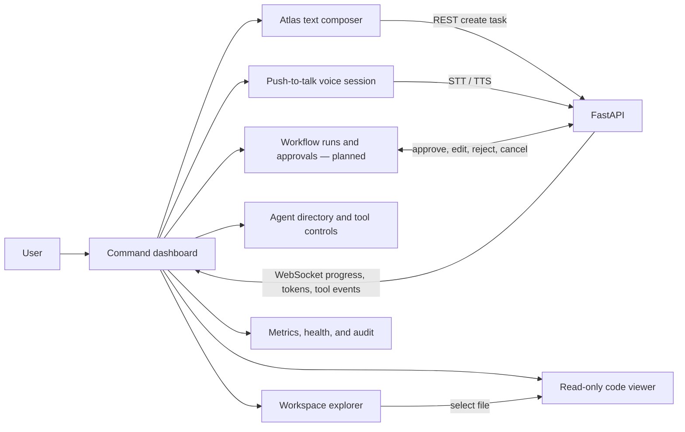

Required experience states:

- `idle`, `listening`, `transcribing`, `planning`, `awaiting_approval`, `queued`, `running`, `validating`, `speaking`, `completed`, `blocked`, `failed`, and `cancelled`.
- The loading modal replaces synthetic status prose such as “Analyzing workspace.”
- Spoken output is generated only from user-facing answer text; stack traces, Markdown syntax, code punctuation, URLs, tool metadata, and raw errors are excluded from speech.

### Layer 2 — API, identity, and transport

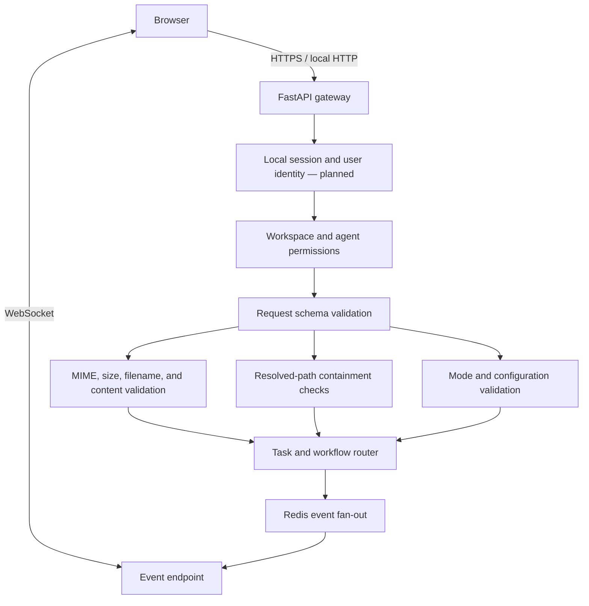

Primary API groups:

| Group | Purpose |
|---|---|
| `/api/tasks` | Create, inspect, cancel, and list task runs |
| `/api/workflows` | **Planned:** definitions, runs, steps, replay, and retry |
| `/api/approvals` | **Planned:** approve, edit, reject, and expire proposed actions |
| `/api/agents` | Named agents, tool permissions, availability, and assigned workflows |
| `/api/workspace` | Safe directory tree and read-only file content |
| `/api/artifacts` | Validated upload, download, metadata, and provenance |
| `/api/speech` | Local transcription and synthesis |
| `/api/health` | Liveness, readiness, dependencies, and optional-service status |
| `/ws/tasks/{run_id}` | Ordered progress, token, approval, tool, artifact, and completion events |

### Layer 3 — Workflow orchestration and governance

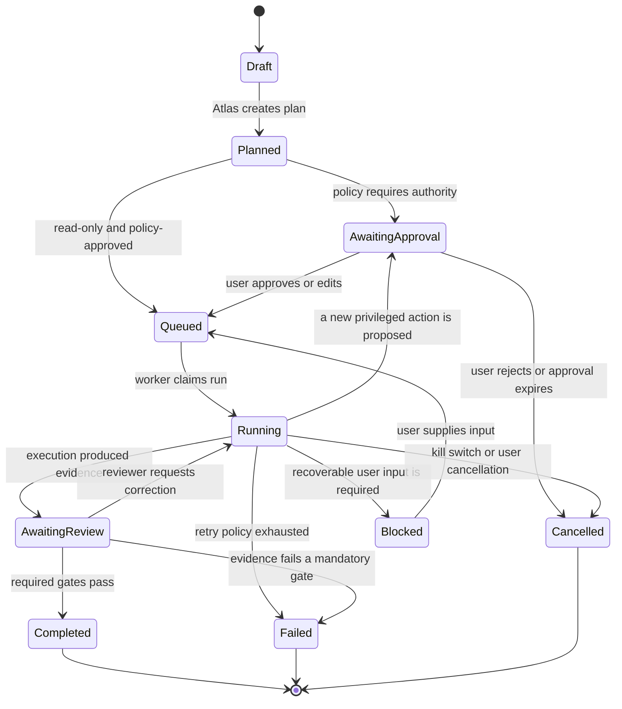

```mermaid
flowchart LR
    REQUEST["User request"] --> INTAKE["Normalize intent and scope"]
    INTAKE --> CONTEXT["Collect permitted context"]
    CONTEXT --> PLAN["Atlas produces a read-only plan"]
    PLAN --> RISK["Classify risk and required reviewers"]
    RISK --> SELECT["Select named specialist workflow"]
    SELECT --> ACL["Verify agent tool ACL"]
    ACL --> GATE{"Approval required?"}
    GATE -->|"yes"| HUMAN["User approve, edit, or reject"]
    HUMAN -->|"approved"| CHECKPOINT["Persist checkpoint"]
    GATE -->|"no"| CHECKPOINT
    CHECKPOINT --> EXECUTE["Execute isolated steps"]
    EXECUTE --> STREAM["Stream ordered events"]
    STREAM --> VALIDATE["Validate output and evidence"]
    VALIDATE --> REVIEW{"Specialist gate required?"}
    REVIEW -->|"yes"| ASSURE["Security, QA, compliance, legal, or release review"]
    ASSURE --> PACKAGE["Package artifacts and findings"]
    REVIEW -->|"no"| PACKAGE
    PACKAGE --> RECORD["Persist audit, hashes, metrics, and memory"]
    RECORD --> RESPONSE["Atlas summarizes outcome to user"]
```

Governance rules:

- Atlas cannot be granted implementation/edit tools through the UI.
- The workflow engine checks permissions at **every tool invocation**, not only at task creation.
- Approval binds to a canonical action hash. Editing tool arguments invalidates the earlier approval and creates a new proposal.
- A global kill switch blocks new work and publishes cancellation to running workers. A per-run switch stops one workflow.
- Retries apply only to explicitly retryable, idempotent steps. Side effects carry idempotency keys and compensation instructions.
- A workflow version is immutable after a run begins. New runs may use a later version; old runs retain their original definition.

### Layer 4 — Agent topology

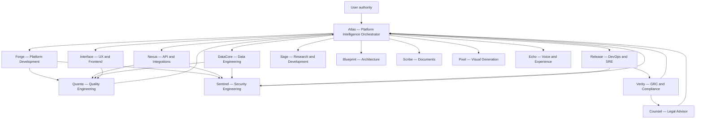

Atlas delegates and synthesizes. Review agents return evidence to Atlas; they do not silently authorize user-controlled actions.

### Layer 5 — Models, memory, speech, and media

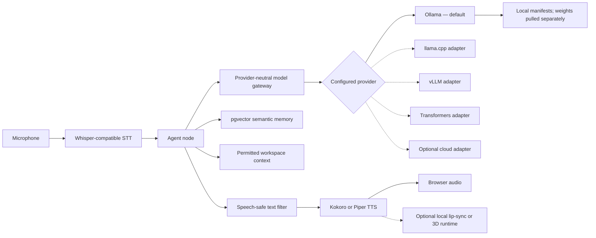

Model gateway contract:

- normalized chat, embedding, structured-output, tool-call, streaming, cancellation, timeout, and health interfaces;
- capabilities discovered per provider/model rather than assumed;
- no hard failure when optional credentials are absent;
- local provider is always the Community-mode default;
- prompts and responses are logged with access controls and configurable retention, never as unbounded raw telemetry.

### Layer 6 — Tool execution and sandboxing

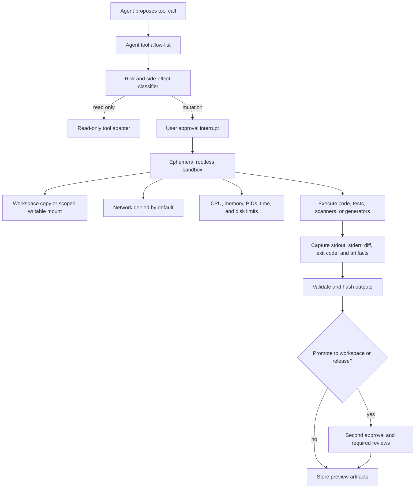

Tool risk tiers:

| Tier | Typical tools | Default gate |
|---|---|---|
| 0 — observe | diagnostics, memory read, files read | Scoped permission; no mutation approval |
| 1 — research/generate | research, browser, document/image/blueprint generation | External access or artifact save may require approval |
| 2 — workspace change | files write, code execution, test execution | Explicit user approval; isolated execution; diff review |
| 3 — privileged change | database admin, deployment, connector secrets | Explicit action-bound approval plus specialist review and rollback plan |

### Layer 7 — Persistence and event data flow

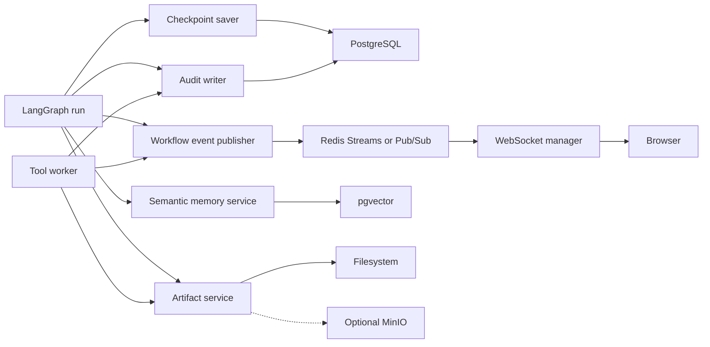

Proposed durable tables:

| Table | Key responsibility |
|---|---|
| `workflow_definitions` | Immutable, versioned graph definitions and policy metadata |
| `workflow_runs` | User, workspace, workflow version, state, risk, timestamps, and final disposition |
| `workflow_steps` | Node attempts, assigned agent, inputs, outputs, retry state, and timing |
| `workflow_approvals` | Proposed action hash, visible scope, decision, user, reason, and expiry |
| `workflow_events` | Ordered replayable event log for UI, diagnostics, and audit |
| `tool_invocations` | Agent, tool, canonical arguments, result, sandbox, duration, and exit data |
| `workflow_evidence` | Tests, scans, diffs, citations, artifacts, hashes, and reviewer findings |
| `agent_assignments` | Run-to-agent responsibilities and handoff history |
| `memory_items` | Scoped semantic memory, embedding, provenance, retention, and access class |

Redis keys/streams are disposable projections. Rebuilding them from PostgreSQL must not change the authoritative outcome of a run.

### Layer 8 — Deployment topology

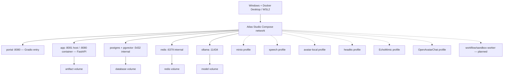

Target Compose addition: a separately constrained `workflow-worker` service. The API should schedule work and stream results; it should not host privileged execution inside the web process.

### Layer 9 — Trust boundaries and security controls

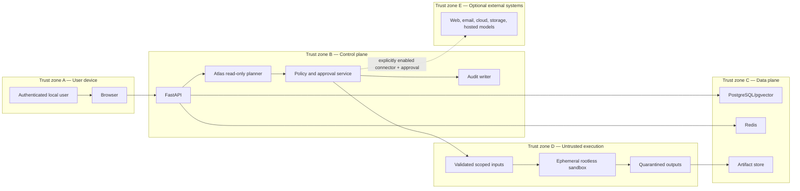

Minimum controls:

- local authentication and CSRF protection before non-loopback access;
- strict workspace ID on every task, artifact, memory, event, and approval;
- resolved-path containment and symlink escape protection;
- per-agent tool allow-lists enforced server-side;
- upload allow-list, size limits, MIME sniffing, archive-bomb protection, quarantine, and malware hooks;
- rootless execution, dropped capabilities, read-only base filesystem, resource ceilings, and network `none` by default;
- secret values never placed in prompts, events, task metadata, or browser payloads;
- audit events for login, permission changes, approvals, tool calls, artifacts, cancellation, and policy bypass attempts;
- signed artifact hashes and immutable evidence references;
- backup/restore drills and retention policy for workflow checkpoints and semantic memory.

### Layer 10 — Observability and operational flow

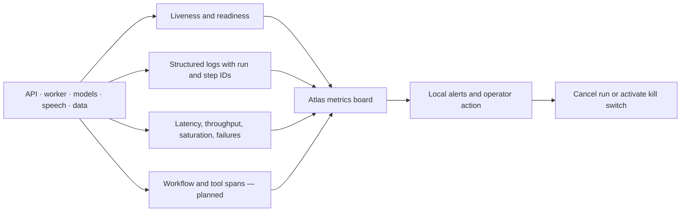

Core service-level objectives to display:

- time to first streamed token, speech transcription time, first-audio latency, and full turn latency;
- queued/running/blocked workflows, approval wait time, retry count, and completion rate;
- model load time, tokens/second, context utilization, timeouts, and fallback count;
- tool duration, sandbox startup time, test/scan pass rate, and failed promotions;
- PostgreSQL connections/storage/checkpoint growth, Redis memory/lag, artifact capacity, and WebSocket clients;
- permission denials, invalid uploads, cancelled steps, policy violations, and kill-switch activations.

## 4. Workflow library decision

### Recommendation

Use **LangGraph OSS** as Atlas Studio's agent workflow library.

Why it fits this platform:

- it is a Python library that can live inside the existing FastAPI application;
- checkpoints persist graph state at each step and support recovery, replay, and long-running threads;
- interrupts natively model user approval with approve/edit/reject decisions;
- streaming maps naturally to the existing WebSocket progress design;
- subgraphs map to named agent workflows;
- an asynchronous PostgreSQL checkpointer aligns with the existing database;
- it does not require a hosted model, hosted tracing service, or purchased key.

Use the MIT-licensed library and community checkpointer packages only. Keep the workflow API, dashboard, audit, and deployment inside Atlas Studio.

### Alternatives

| Library | Strength | Fit for Atlas Studio | Decision |
|---|---|---|---|
| **LangGraph OSS** | Stateful agent graphs, checkpoints, streaming, interrupts, subgraphs | Best match for governed multi-agent work in the current Python stack | **Adopt now** |
| **Temporal OSS** | Very strong durable execution across services and long outages | Excellent future control plane, but adds a substantial server/worker operational layer | Re-evaluate when workflows span many services or require stronger distributed guarantees |
| **Prefect OSS** | Data/batch flows, scheduling, work pools, Docker workers, UI | Useful for scheduled data and operations jobs; duplicates parts of Atlas UI/control plane | Consider later for scheduled pipelines, not primary agent orchestration |
| **Celery** | Mature Redis-backed task execution; chains, groups, and chords | Good task runner, but human approval and durable agent state would be custom work | Optional execution backend, not the workflow source of truth |

Do not install multiple primary orchestrators initially. LangGraph plus the existing PostgreSQL and Redis services provides the smallest coherent architecture.

## 5. Universal workflow contract

Every agent workflow implements the following contract:

```text
request
  -> scope and permission check
  -> context collection
  -> plan and risk classification
  -> agent assignment
  -> approval interrupt when required
  -> checkpoint
  -> isolated execution
  -> progress events
  -> validation and required specialist gates
  -> evidence and artifact persistence
  -> Atlas synthesis
  -> user acceptance or follow-up
```

Required workflow state:

```yaml
run_id: uuid
workspace_id: uuid
workflow_name: string
workflow_version: integer
requested_by: user_id
orchestrator: atlas
assigned_agents: [agent_id]
intent: string
scope: object
risk_tier: 0|1|2|3
requested_tools: [tool_id]
approval_ids: [uuid]
status: draft|planned|awaiting_approval|queued|running|awaiting_review|blocked|failed|cancelled|completed
current_step: string
checkpoint_id: string
inputs: object
outputs: object
artifacts: [artifact_ref]
evidence: [evidence_ref]
errors: [sanitized_error]
created_at: datetime
updated_at: datetime
```

Required WebSocket event envelope:

```json
{
  "event_id": "uuid",
  "sequence": 17,
  "run_id": "uuid",
  "step_id": "uuid",
  "type": "step.started",
  "agent_id": "forge",
  "timestamp": "RFC3339",
  "visibility": "user",
  "payload": {}
}
```

Event types include `run.created`, `plan.ready`, `approval.requested`, `approval.decided`, `step.queued`, `step.started`, `token.delta`, `tool.proposed`, `tool.started`, `tool.completed`, `artifact.created`, `review.requested`, `review.completed`, `step.retrying`, `run.blocked`, `run.cancelled`, `run.failed`, and `run.completed`.

## 6. Workflow catalog for every named agent

### Atlas — Platform Intelligence Orchestrator

Permitted mode: read-only.

| Workflow | Steps | Output |
|---|---|---|
| Intake and triage | interpret request → identify workspace/scope → classify risk → select specialists → produce plan | User-visible plan and assignments |
| Platform diagnostics | health/read-only config → logs/metrics → dependency checks → correlate failures | Diagnostic report with evidence |
| Investigation | establish hypothesis → collect permitted facts → test non-mutating checks → rank causes | Findings and recommended next action |
| Research synthesis | define question → delegate Sage/others → verify sources → compare options | Cited recommendation |
| Run coordination | monitor events → detect block/failure → request input or reroute → synthesize results | Unified run status and final response |

Atlas must never execute the proposed fix.

### Forge — Platform Development AI

| Workflow | Steps | Required gates | Output |
|---|---|---|---|
| Feature implementation | inspect → design change → approval → branch/sandbox → edit → tests → diff | User approval; Quanta; Sentinel if security-relevant | Patch, tests, implementation notes |
| Bug fix | reproduce → root cause → approval → minimal fix → regression test | User approval; Quanta | Patch and regression evidence |
| Refactor | baseline behavior → impact map → approval → incremental refactor → regression suite | User approval; Quanta | Refactor diff and unchanged-behavior evidence |
| Dependency/config update | inventory → compatibility/security review → approval → update → build/test | User approval; Sentinel for supply-chain risk | Locked dependency/config diff |

### Sentinel — Security Engineering

| Workflow | Steps | Required gates | Output |
|---|---|---|---|
| Threat model | identify assets/actors → map trust boundaries → enumerate threats → rank mitigations | Read-only unless a fix is requested | Threat model and prioritized controls |
| Secure code review | determine changed surface → inspect auth/input/secrets/data flows → validate findings | User approval only for active scans | Findings with severity and evidence |
| Vulnerability scan | approve scan scope → isolated scan → deduplicate → validate → assign owner | User approval for execution/network | Scan report and remediation tasks |
| Incident triage | preserve evidence → scope impact → contain only with approval → root cause → recovery plan | Explicit approval for containment | Incident timeline and action plan |
| Hardening verification | map expected control → test configuration → record exceptions | Approval for active tests | Control verification evidence |

### Verity — GRC and Compliance

| Workflow | Steps | Required gates | Output |
|---|---|---|---|
| Control mapping | select framework → map system controls → attach evidence → identify gaps | Read-only | Control matrix |
| Gap assessment | establish scope → test evidence sufficiency → rank gaps → recommend owners/dates | Read-only | Gap and remediation register |
| Compliance change review | inspect proposed change → identify obligations → request evidence → approve/flag | Before regulated releases | Compliance decision record |
| Evidence package | collect hashes/reports/approvals → validate provenance → index package | Read-only | Audit-ready evidence bundle |
| Risk register update | identify risk → assess likelihood/impact → treatment plan → owner review | User accepts risk | Versioned risk entry |

### Quanta — Quality and Test Engineering

| Workflow | Steps | Required gates | Output |
|---|---|---|---|
| Test plan | inspect requirements/change → map scenarios → prioritize → define exit criteria | Read-only design | Test plan |
| Automated test run | approval → isolated environment → execute → collect coverage/results → triage | User approval for execution | Test report and artifacts |
| Regression gate | select impacted suites → run → compare baseline → block or pass | Required before promotion | Signed quality gate |
| Performance test | define load budget → approval → execute bounded load → analyze bottlenecks | Explicit resource approval | Latency/throughput report |
| Reproduction workflow | normalize bug → prepare fixture → reproduce → minimize case | User approval for execution | Reproducible failing test |

### Sage — Research and Development

| Workflow | Steps | Required gates | Output |
|---|---|---|---|
| Technology research | define decision → authoritative sources → compare maturity/license/resources | External browsing must be enabled | Cited research dossier |
| Architecture alternatives | requirements → options → constraints → weighted tradeoffs → recommendation | Read-only | Alternatives analysis |
| Feasibility spike | hypothesis → experiment plan → approval → isolated prototype → evaluate | Approval for code execution | Spike artifact and conclusion |
| Benchmark study | define dataset/metrics → approval → repeatable runs → analyze | Resource approval | Benchmark evidence |

### Counsel — AI Legal Advisor

| Workflow | Steps | Required gates | Output |
|---|---|---|---|
| License review | identify dependency/assets → read licenses → compatibility assessment → flag counsel items | Read-only | License matrix; not legal advice |
| Privacy issue spotting | map data flows → identify personal/sensitive data → retention/consent review | Read-only | Privacy risk memo |
| Terms/policy review | identify jurisdiction/scope → clause comparison → risk flags → human counsel escalation | Read-only | Review notes and escalation list |
| Contract clause analysis | extract clause → compare approved position → explain deviations | Authorized documents only | Clause table; not legal advice |

### Scribe — Document Engineering

| Workflow | Steps | Required gates | Output |
|---|---|---|---|
| Technical documentation | inspect source/evidence → outline → draft → verify links/code → approval | User approval to write | Versioned document |
| SOP/runbook | define trigger/owner → exact steps → rollback/escalation → validation | User approval | Operational runbook |
| API documentation | inspect OpenAPI/code → examples → error and auth cases → validation | User approval | API reference |
| Release notes | gather merged changes → categorize → breaking changes/migrations → approve | Release gate | Release notes |

### Pixel — Image and Visual Generation

| Workflow | Steps | Required gates | Output |
|---|---|---|---|
| Product visual | brief → permitted references → local generation → review → export | Rights attestation and user approval | Image plus generation provenance |
| Diagram asset | receive structured specification → generate → accessibility review → export | User approval to save | Visual asset and alt text |
| Image variants | select authorized source → define differences → generate → compare | Rights attestation | Versioned variants |
| UI concept | requirements → visual direction → generate mockup → Interface review | User approval | Concept image; not production code |

### Blueprint — Architecture and Blueprint Generation

| Workflow | Steps | Required gates | Output |
|---|---|---|---|
| System architecture | requirements → current-state map → target layers → risks → decisions | Read-only | Architecture diagrams and ADRs |
| Data flow and trust boundaries | enumerate data → sources/sinks → boundaries → controls | Sentinel review for security use | Data-flow diagram |
| Deployment blueprint | service inventory → topology → resources → recovery → rollout | Release and Sentinel review | Deployment design |
| Implementation roadmap | dependencies → phases → acceptance criteria → sequencing | User accepts scope | Phased roadmap |

### Nexus — API and Integration Engineering

| Workflow | Steps | Required gates | Output |
|---|---|---|---|
| API contract | inspect consumers → schema → auth/errors/idempotency → examples → review | User approval to implement | OpenAPI and tests |
| Provider adapter | capability contract → local stub → approval → implementation → integration tests | User approval; optional credentials remain absent-safe | Adapter and tests |
| Webhook/event integration | define event/envelope → signature/replay policy → approval → implement/test | Sentinel review | Event integration |
| Connector enablement | inventory requested scopes → approval → secret binding → least-privilege test | Explicit integration approval | Disabled-by-default connector config |

### DataCore — Data Engineering

| Workflow | Steps | Required gates | Output |
|---|---|---|---|
| Schema migration | model change → compatibility/rollback → approval → dry-run → apply → verify | User approval; backup/rollback evidence | Migration and verification |
| Semantic memory | define scope/schema → embedding policy → retention/access → implement/test | Privacy and user approval | pgvector memory pipeline |
| Import/ETL | profile source → map/validate → approval → staged import → reconciliation | User approval | Reconciled dataset and report |
| Data quality | define rules → scan → exceptions → remediation plan | Approval for scan if large | Quality report |
| Backup/restore test | create recovery point → isolated restore → validate → document RPO/RTO | Explicit operational approval | Recovery evidence |

### Interface — UX and Frontend Engineering

| Workflow | Steps | Required gates | Output |
|---|---|---|---|
| Feature page | inspect design system → interaction spec → approval → implement → browser test | User approval; Quanta | UI patch and screenshots |
| Accessibility review | semantic audit → keyboard/focus → contrast/labels → fixes if approved | Approval for mutations | Accessibility report/patch |
| Responsive validation | target widths → browser checks → issue capture → fixes | Approval for mutations | Responsive evidence |
| Design-system alignment | inventory tokens/components → identify drift → plan → approved changes | User approval | Consistent component updates |

### Release — DevOps and SRE

| Workflow | Steps | Required gates | Output |
|---|---|---|---|
| Container build | validate config → approval → build → scan → health test | User approval; Sentinel/Quanta | Image digest and evidence |
| Local deployment | preflight → backup → approval → deploy → health/smoke → rollback if needed | Explicit deployment approval | Deployment record |
| Observability change | define signal/SLO → approval → implement → verify cardinality/overhead | User approval | Dashboard/alert config |
| Recovery operation | diagnose → present recovery plan → approval → execute → validate | Explicit critical approval | Recovery audit record |
| Release gate | collect QA/security/compliance/evidence → user go/no-go → deploy/stop | All required reviews and user approval | Signed release disposition |

### Echo — Voice and Experience Coordinator

| Workflow | Steps | Required gates | Output |
|---|---|---|---|
| Speech configuration | inspect local engines/voices → latency/quality test → recommend | Read-only | Voice configuration report |
| Voice turn | capture → VAD → local STT → Atlas task → speech-safe text → local TTS → synchronized transcript | Microphone permission | Audio plus ordered transcript |
| Pronunciation cleanup | identify symbols/errors → normalize abbreviations/numbers → test voice | Read-only | Speech normalization rules |
| Voice latency diagnosis | measure capture/STT/model/TTS/playback → identify bottleneck | Read-only | Turn-latency breakdown |
| Avatar synchronization | inspect supported runtime → map audio/visemes/state → test | Approval for media execution | Synchronization report/artifacts |

## 7. Cross-agent workflow blueprints

### Software feature delivery

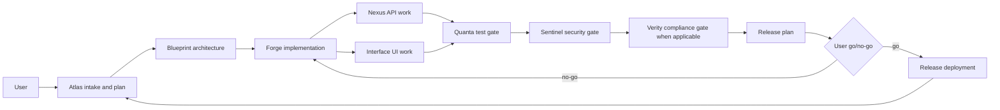

### Security remediation

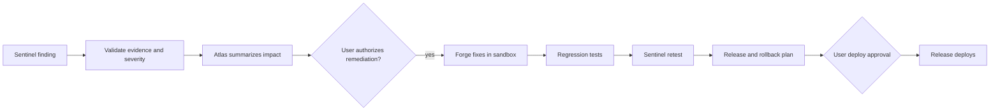

### Regulated change

```mermaid
flowchart LR
    PLAN["Atlas and Blueprint plan"] --> VERITY["Verity maps controls"]
    VERITY --> COUNSEL["Counsel spots legal/privacy issues"]
    COUNSEL --> USER["User scope approval"]
    USER --> BUILD["Forge/Nexus/DataCore/Interface implementation"]
    BUILD --> QA["Quanta evidence"]
    QA --> SECURITY["Sentinel evidence"]
    SECURITY --> PACKAGE["Verity evidence package"]
    PACKAGE --> GO["User release decision"]
    GO --> RELEASE["Release deploys and records outcome"]
```

### Research-to-decision

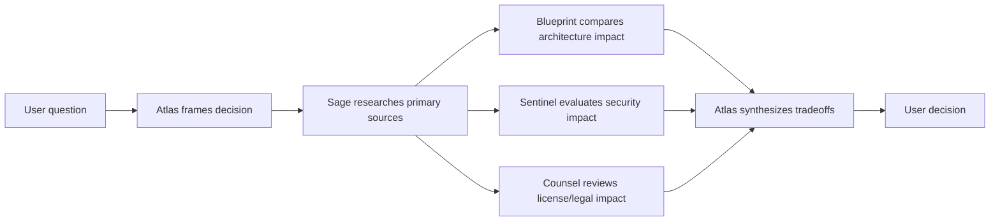

## 8. Incremental implementation plan

### Phase 1 — Workflow foundation

1. Add `langgraph`, the PostgreSQL checkpointer package, and pinned versions to the Python dependencies.
2. Add migrations for workflow definitions, runs, steps, approvals, events, tool invocations, evidence, and assignments.
3. Define typed workflow state and the ordered event envelope.
4. Add a workflow registry and start with one universal governed graph.
5. Use an asynchronous PostgreSQL checkpointer; use in-memory persistence only in unit tests.

Acceptance: a run can pause, survive an app restart, resume with the same `run_id`, and replay its event history.

### Phase 2 — Authorization and policy

1. Convert the existing agent/tool configuration into server-enforced ACLs.
2. Define the four tool risk tiers and approval rules.
3. Add action-bound approval records with approve/edit/reject/expiry.
4. Add global and per-run cancellation.
5. Ensure Atlas can never be configured with mutating tools.

Acceptance: an unapproved write, command, SQL change, deployment, or external connector call cannot execute even if prompted by a model.

### Phase 3 — API and live workflow UI

1. Add workflow and approval REST endpoints.
2. Add ordered WebSocket events with reconnect-from-sequence support.
3. Add a Workflow Board showing graph, current node, agent, duration, approvals, artifacts, and evidence.
4. Add an approval drawer that exposes exact arguments, affected workspace, risk, and rollback.
5. Add retry, replay-from-checkpoint, cancel, and evidence-download controls.

Acceptance: the user can watch, interrupt, approve, reject, cancel, reconnect, and audit a run from the dashboard.

### Phase 4 — Isolated worker

1. Add a separate `workflow-worker` Compose service.
2. Implement rootless ephemeral sandbox launch with network `none`, quotas, timeouts, and scoped mounts.
3. Capture diffs, stdout/stderr, exit codes, artifacts, and resource metrics.
4. Make mutating steps idempotent or compensatable.
5. Quarantine outputs before promotion.

Acceptance: killing the API does not corrupt a run; killing a worker causes a safe retry or a clearly blocked run, never a duplicated side effect.

### Phase 5 — Agent workflow rollout

Implement in this order:

1. Atlas intake/triage and Forge bug-fix/feature workflows.
2. Quanta test gate and Sentinel security review.
3. Interface, Nexus, DataCore, and Release engineering paths.
4. Sage, Blueprint, Scribe, Pixel, Echo, Verity, and Counsel specialist paths.
5. Cross-agent feature delivery, security remediation, regulated change, and research-to-decision graphs.

Each workflow receives unit tests, restart/resume tests, denied-tool tests, approval-binding tests, cancellation tests, and end-to-end local Compose tests.

### Phase 6 — Reliability and operations

1. Add workflow metrics, traces, checkpoint retention, and dead-letter review.
2. Add database backup/restore and event-rebuild drills.
3. Add load tests for WebSocket fan-out and concurrent local-model runs.
4. Add model, speech, and worker warm-up strategies.
5. Add workflow evaluation fixtures that check correctness, policy compliance, evidence quality, and latency.

## 9. Definition of done for every workflow

A workflow is production-ready only when:

- it has a named owner agent and immutable version;
- inputs, outputs, permissions, risk tier, and approval policy are typed;
- every tool call is allow-listed and audited;
- side effects are isolated, approved, idempotent, and reversible where possible;
- restart/resume, timeout, retry, cancellation, and kill-switch behavior are tested;
- user-visible events are ordered, reconnectable, and free of secrets;
- required QA, security, compliance, legal, and release gates are explicit;
- output artifacts are validated, hashed, scoped to a workspace, and linked to evidence;
- Atlas produces a concise final synthesis without claiming work that did not complete.

## 10. Primary technical references

- [LangGraph overview](https://docs.langchain.com/oss/python/langgraph/overview)
- [LangGraph persistence and checkpoints](https://docs.langchain.com/oss/python/langgraph/persistence)
- [LangGraph interrupts](https://docs.langchain.com/oss/python/langgraph/interrupts)
- [LangChain human-in-the-loop policy](https://docs.langchain.com/oss/python/langchain/human-in-the-loop)
- [LangGraph MIT license](https://github.com/langchain-ai/langgraph/blob/main/LICENSE)
- [Temporal documentation](https://docs.temporal.io/)
- [Temporal open-source repository](https://github.com/temporalio/temporal)
- [Prefect self-hosted Docker Compose](https://docs.prefect.io/v3/how-to-guides/self-hosted/docker-compose)
- [Prefect Docker work pools](https://docs.prefect.io/v3/how-to-guides/deployment_infra/docker)
- [Celery Canvas workflows](https://docs.celeryq.dev/en/main/userguide/canvas.html)

