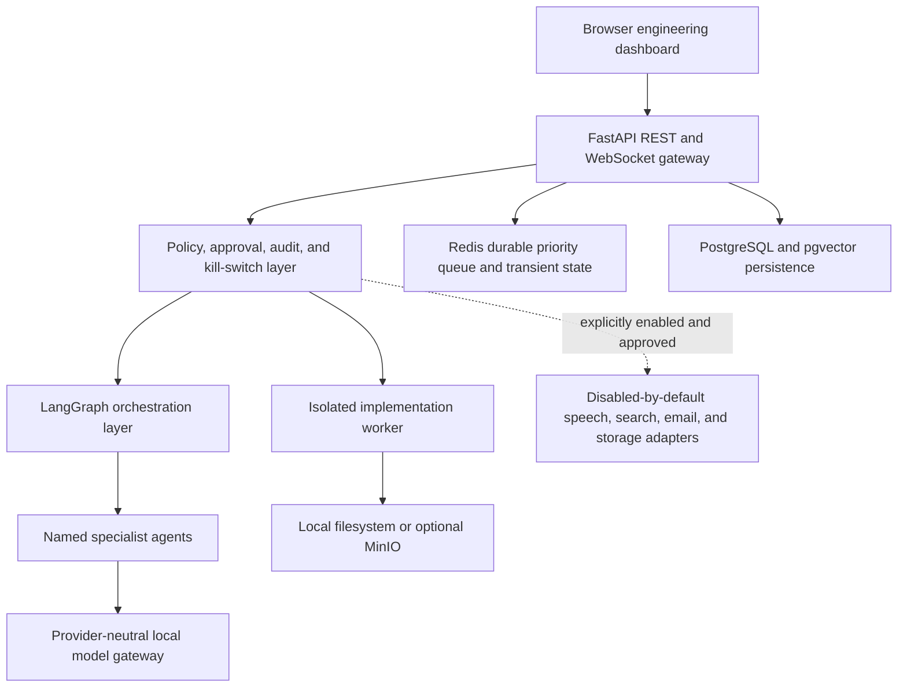
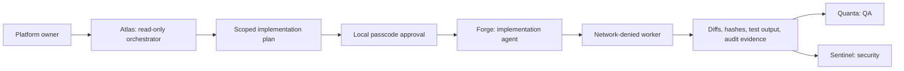
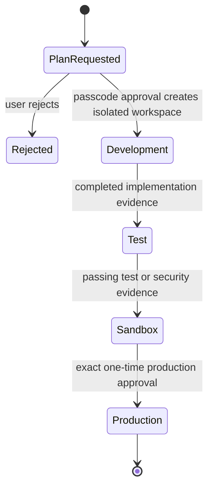
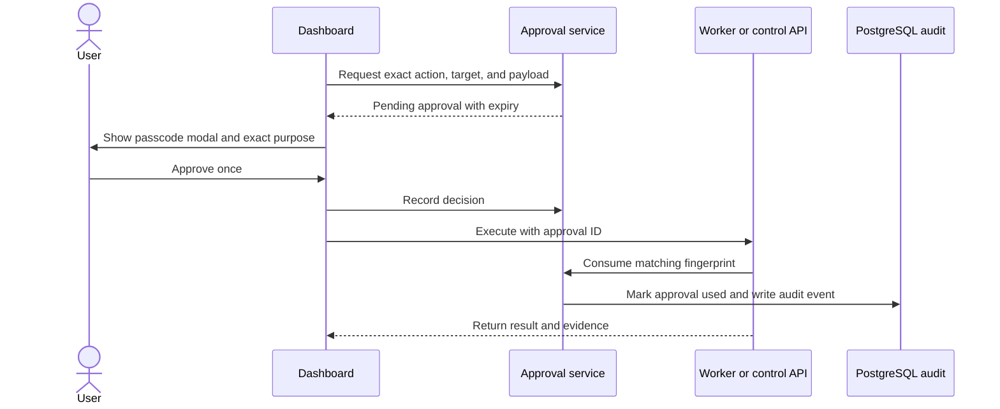
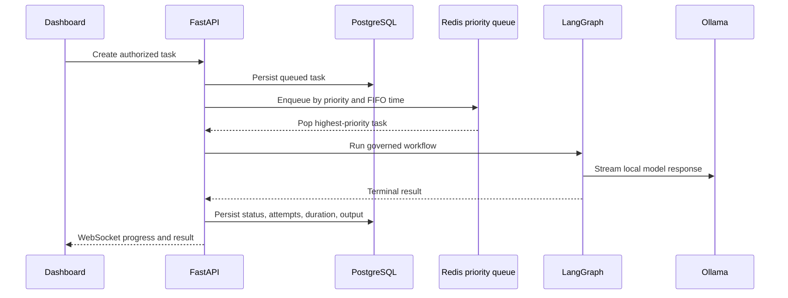

# Atlas Studio Architecture and Action Plan

## Operating model

Atlas Studio is a standalone, local-first engineering control plane. Community mode requires no purchased API key. Atlas is the read-only orchestrator; Forge is the default implementation agent. Mutating operations are performed only by a separate, network-denied worker after an exact, expiring, one-time user approval.

## Platform layers

## Agent authority flow

Atlas can inspect, diagnose, research through approved routes, and coordinate. It cannot write files or execute implementation commands. Agent creation, removal, and permission changes are protected actions.

## Development lifecycle

Every implementation plan owns a separate workspace in the worker volume. A task cannot claim another plan's workspace. Direct implementation tasks are rejected unless they reference an approved plan and its ready workspace.

## Protected-action workflow

Changing any approved path, command, content, workspace, permission list, or promotion evidence invalidates the fingerprint and requires a new approval.

## Durable task data flow

On restart, PostgreSQL is the source of truth. Interrupted running tasks return to queued state and are re-added to Redis. Stale Redis entries cannot rerun terminal tasks.

## Workspace and execution boundaries

- The API mounts the source workspace read-only.
- The worker can read the source only to create a plan workspace.
- All implementation writes and commands resolve beneath that plan workspace.
- Paths are normalized and traversal outside the workspace is rejected.
- Executables are allow-listed; arbitrary shell strings are not accepted.
- The worker has no external network, no Linux capabilities, a read-only container root, CPU and memory limits, and `no-new-privileges`.
- The raw Docker socket is not exposed to the web application or Atlas.

## Dashboard organization

Primary engineering pages:

1. Command dashboard and Atlas assistant
2. Workspace Explorer and read-only Code view
3. Tasks and Plans
4. Implementation evidence
5. Agents and Tools
6. Knowledge and Sources of Truth
7. Workflows, Security, QA, and Metrics

Administrative pages grouped under Settings:

1. Sandbox policy
2. Development, Test, Sandbox, and Production environments
3. User profile and user management
4. Local OAuth configuration
5. Approved external research
6. Runtime and integration configuration

## Implementation status

Completed in this increment:

- Durable Redis priority queue with PostgreSQL restart recovery
- Critical/high/normal/low ordering with Forge promoted to the high lane
- Exact, expiring, single-use approvals for worker actions and Production promotion
- Passcode-protected agent creation, removal, and tool-permission changes
- Plan-specific isolated worker workspaces
- Server-side prevention of direct implementation-task bypass
- Evidence-based Development, Test, Sandbox, and Production transitions
- Dashboard forms for tasks, plans, isolated worker actions, and lifecycle promotion
- Updated migrations, configuration validation, health behavior, test coverage, and operating documentation

## Next action plan

### Phase 1: deploy and verify the control plane

1. Rebuild the `app` and `worker` images.
2. Recreate those services so additive migrations run against the existing PostgreSQL volume.
3. Create a plan, approve it, and confirm its isolated workspace becomes ready.
4. Preview a file change, approve the exact write, run tests, and record lifecycle evidence.
5. Restart the app during a queued task and verify restart recovery.

### Phase 2: strengthen environment isolation

1. Replace the internal worker process boundary with rootless Docker or Podman sandbox-per-action adapters.
2. Give Development, Test, and Sandbox separate artifact namespaces and retention policies.
3. Add malware scanning, MIME verification, and content hashes to every uploaded artifact.
4. Add local backup and restore for PostgreSQL, Redis recovery metadata, artifacts, and plan workspaces.

### Phase 3: production-grade identity and governance

1. Add local accounts, sessions, roles, and workspace memberships.
2. Keep Google OAuth optional and disabled in Community mode.
3. Add separation-of-duties rules for security review and Production approval.
4. Add audit retention, export, signing, and tamper-evidence controls.

### Phase 4: performance and local intelligence

1. Move model task execution into horizontally scalable Redis consumers.
2. Add a local embedding provider and workspace-scoped pgvector retrieval.
3. Stream STT partials, LLM tokens, sentence-level TTS, and avatar visemes concurrently.
4. Load optional speech, avatar, search, and storage services only when their feature flags are enabled.

### Phase 5: release assurance

1. Run concurrency, cancellation, timeout, path-traversal, cross-workspace, and kill-switch integration tests.
2. Add dependency license and model provenance inventories.
3. Validate degraded operation with Ollama, PostgreSQL, Redis, and optional integrations individually unavailable.
4. Add disaster-recovery and rollback drills before any network-exposed deployment.
